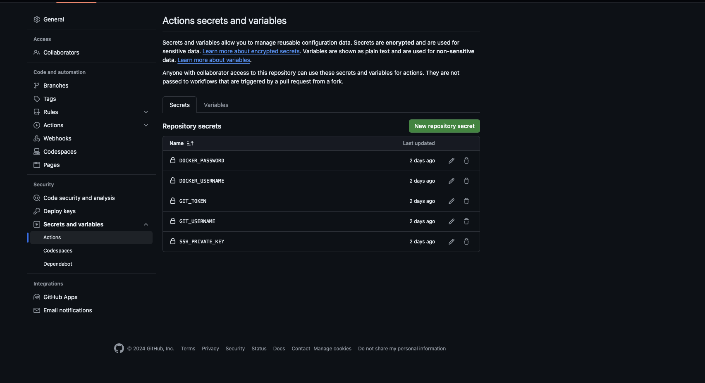

# SK's Magento DevOps - CI/CD

## Local run
Start application by running this script like below:
```sh
chmod +x scripts/run_app.sh
sh scripts/run_app.sh
```

Or you can run docker compose command directly:
```sh
docker compose -p joomla-local --env-file docker/config/.env.local -f docker/docker-compose.local.yml up --no-deps --build -d
```

If you want to update environment variables, you can modify the values in those `.env.<ENVIRONMENT>` files

## Git Branch Strategy for Multiple Environments

### Overview

A well-defined Git branch strategy helps manage code changes across different environments efficiently. In this document, we outline a branch strategy that supports three key environments: Development (`dev`), Pre-Production (`preprod`), and Production (`prod`). This approach ensures organized development, thorough testing, and stable deployments.

### Branches

#### 1. **Development Branch (`dev`)**

- **Purpose**: The `dev` branch is the main branch for ongoing development and integration work. Developers create feature branches off `dev` and merge them back into `dev` when completed.
- **Usage**: 
  - Pull requests (PRs) should be made to `dev` for code reviews and integration.
  - This branch reflects the latest, albeit unstable, state of the code.

#### 2. **Pre-Production Branch (`preprod`)**

- **Purpose**: The `preprod` branch is used for staging and testing before deployment to production. It should closely mirror the production environment to catch any issues that may not appear in development.
- **Usage**:
  - Code is merged into `preprod` from `dev` when features are ready for pre-production testing.
  - This branch is used for final testing and validation before changes are merged into `prod`.

#### 3. **Production Branch (`prod`)**

- **Purpose**: The `prod` branch represents the stable, live version of the application. Only thoroughly tested and approved changes are merged into this branch.
- **Usage**:
  - Code is merged into `prod` from `preprod` after successful staging tests and approvals.
  - This branch should always be in a deployable state.

### Workflow

#### Feature Development

1. **Create a Feature Branch**:
   - From `dev`, create a new branch for each feature or bug fix.
   - Example: `feature/your-feature-name`.

2. **Develop and Test Locally**:
   - Make changes and test them locally.

3. **Merge Feature Branch into `dev`**:
   - Once development is complete and tested locally, create a pull request (PR) to merge the feature branch into `dev`.

#### Staging

1. **Merge `dev` into `preprod`**:
   - After integrating and testing features in `dev`, merge `dev` into `preprod` for staging and further testing.

2. **Perform Staging Tests**:
   - Test the application in the pre-production environment to identify any issues.

3. **Approval and Bug Fixes**:
   - Fix any bugs found during staging and ensure that the `preprod` branch is stable.

#### Production Deployment

1. **Merge `preprod` into `prod`**:
   - After successful staging tests, create a PR to merge `preprod` into `prod`.

2. **Deploy to Production**:
   - Deploy the code from `prod` to the live environment.

3. **Monitor and Support**:
   - Monitor the production environment for any issues post-deployment.

#### Hotfix Flow

1. **Create a Hotfix Branch**:
   - From `prod`, create a hotfix branch to address critical issues affecting the production environment.
   - Example: `hotfix/fix-critical-issue`.

2. **Develop and Test the Hotfix**:
   - Apply the fix and test it locally. Ensure the issue is resolved.

3. **Merge Hotfix Branch into `prod`**:
   - Create a PR to merge the hotfix branch into `prod`. This should be done as soon as possible to minimize the impact of the issue.

4. **Merge Hotfix Branch into `preprod`**:
   - After merging into `prod`, merge the hotfix branch into `preprod` to ensure the fix is also present in the staging environment.

5. **Merge Hotfix Branch into `dev`**:
   - Finally, merge the hotfix branch into `dev` to ensure that the fix is included in ongoing development work.


### Branch Management

- **Naming Conventions**:
  - Use clear and descriptive names for feature branches and PRs.
  - Example: `bugfix/fix-login-error`, `feature/add-user-profile`.

- **Branch Protection**:
  - Enable branch protection rules to ensure code reviews and testing before merging into `dev`, `preprod`, and `prod`.

### Summary

This branch strategy provides a structured approach to managing code changes across different environments. By following this workflow, you ensure that development, testing, and deployment processes are organized and efficient, leading to a more stable and reliable application.

## CI/CD Pipeline with GitHub Actions

### Overview

GitHub Actions automates the CI/CD processes directly within GitHub repositories. This section explains how to set up GitHub Actions for managing development (`dev`), pre-production (`preprod`), and production (`prod`) environments, including Continuous Integration (CI) and Continuous Deployment (CD) pipelines.

### CI/CD Pipeline Structure

#### Continuous Integration (CI)

The CI pipeline is responsible for building and testing code changes to ensure that they meet quality standards. It is triggered by pushes or pull requests (PRs) to the `dev` and `preprod` branches.

**Key Steps:**
1. **Code Checkout**: Retrieves the latest code from the repository.
2. **Setup Environment**: Configures the required environment (e.g., PHP, Node.js).
3. **Install Dependencies**: Installs project dependencies.
4. **Lint Code**: Runs static analysis tools to enforce code quality standards.
5. **Run Unit Tests**: Executes automated tests to verify code correctness.
6. **Build Docker Image**: Builds the Docker image to ensure it integrates correctly.

#### Continuous Deployment (CD)

The CD pipeline deploys code to the corresponding environments based on branch updates. It ensures that changes are automatically deployed to development, pre-production, or production environments as code is merged into these branches.

**Development Deployment:**
- **Trigger**: Occurs on pushes or PRs merged to the `dev` branch.
- **Steps**: Includes building Docker images specific to the development environment and deploying these changes.

**Pre-Production Deployment:**
- **Trigger**: Occurs on pushes or PRs merged to the `preprod` branch.
- **Steps**: Similar to development deployment, but targets the pre-production environment. It ensures that code has been tested in a staging-like environment.

**Production Deployment:**
- **Trigger**: Occurs on pushes or PRs merged to the `main` branch.
- **Steps**: Builds and pushes Docker images for production and deploys the code to the live environment. This step is crucial for delivering stable and tested features to end-users.


### Configuration Updates

1. **`DOCKER_REGISTRY`**:
   - **Description**: The Docker registry where your Docker images will be pushed.
   - **Update**: Replace `aadhavgroup` with the name of your Docker registry.

2. **`SERVER_HOST`**:
   - **Description**: The IP address or hostname of the server where the application will be deployed.
   - **Update**: Replace `116.202.210.154` with the IP address or hostname of your server.

3. **`SSH_USER`**:
   - **Description**: The SSH username used to access your server.
   - **Update**: Replace `root` with the appropriate SSH username for your server.

4. **`SSH_PORT`**:
   - **Description**: The port used for SSH connections to your server.
   - **Update**: Replace `9022` with the port number used by your server for SSH.

5. **`REMOTE_DATA_DIR`**:
   - **Description**: The directory on the remote server where application data and files are stored.
   - **Update**: Modify `/opt` if your project requires a different remote directory.

6. **`REPO_NAME`**:
   - **Description**: The name of your GitHub repository.
   - **Update**: Replace `Joomla` with the name of your repository.

7. **`GITHUB_ORG`**:
   - **Description**: The GitHub organization or user name that owns the repository.
   - **Update**: Replace `aadhavgroup` with your GitHub organization name or username.

### Additional Considerations

- **Docker Image Tags**:
  - Ensure that the tags used in Docker build and push steps (e.g., `dev-${{ env.GIT_SHA }}`, `preprod-${{ env.GIT_SHA }}`, `prod-${{ env.GIT_SHA }}`) align with your project's versioning or tagging strategy.

- **Environment-Specific Configuration**:
  - If your project requires different environment variables or deployment scripts, update the deployment steps accordingly.

- **Secrets Management**:
  - Ensure that GitHub Secrets (`DOCKER_USERNAME`, `DOCKER_PASSWORD`, `SSH_PRIVATE_KEY`, `GIT_USERNAME`, and `GIT_TOKEN`) are configured correctly for your new project.

- **Branch Names**:
  - Verify that branch names (`dev`, `preprod`, `main`) match those used in your new project's repository. Adjust branch names in the `if` conditions as needed.

By making these updates, you can effectively adapt the CI/CD workflow to suit the needs of your new project.

### Summary

By implementing CI/CD pipelines with GitHub Actions, you automate the processes of code integration, testing, and deployment. This setup ensures that:
- Code changes are continuously tested and validated before integration.
- Deployments to development, pre-production, and production environments are managed systematically and automatically.

This streamlined approach enhances development efficiency, reduces manual intervention, and improves the reliability of deployments.

## Appendix

### Generating a GitHub Personal Access Token

A GitHub personal access token (PAT) allows you to access GitHub's API and perform actions such as cloning repositories, pushing code, and managing workflows. Follow these steps to generate a new token:

**Step 1: Log in to GitHub**

1. Open your web browser and go to [GitHub](https://github.com).
2. Log in to your GitHub account.

**Step 2: Navigate to the Personal Access Tokens Page**

1. In the upper-right corner of any page, click your profile photo, then click **Settings**.
2. In the left sidebar, click **Developer settings**.
3. In the left sidebar, click **Personal access tokens**.
4. Click **Generate new token**.

**Step 3: Configure Your New Token**

1. Give your token a descriptive name in the **Note** field, so you remember its purpose.
2. Select the **Expiration** date for your token. Choose a suitable expiration period based on your needs.
3. Select the scopes or permissions you wish to grant this token. For a CI/CD pipeline, you might need the following scopes:
    - **repo**: Full control of private repositories

**Step 4: Generate and Copy Your Token**

1. Click the **Generate token** button at the bottom of the page.
2. Once the token is generated, copy it. **This is the only time you will be able to see the token.** If you lose it, you will need to generate a new token.

**Step 5: Store Your Token Securely**

1. Save your token in a secure location, such as a password manager.
2. If you're using this token in a GitHub Actions workflow, store it as a GitHub Secret.

**Step 6: Add Your Token as a GitHub Secret**

1. In your GitHub repository, go to **Settings**.
2. In the left sidebar, click **Secrets and variables**.
3. Click **Actions**.
4. Click **New repository secret**.
5. Name your secret (`GIT_TOKEN`).
6. Paste your token into the **Value** field.
7. Click **Add secret**.


For more information, visit the [GitHub documentation](https://docs.github.com/en/github/authenticating-to-github/creating-a-personal-access-token).


### Set up Github action secrets
To securely deploy to a remote server via SSH in your GitHub Actions CD pipeline, follow these steps to set up SSH authentication using GitHub Secrets.

**Step 1: Generate SSH Keys**

If you don’t already have an SSH key pair, generate one using the following command on your local machine:

```sh
ssh-keygen -t rsa -b 4096 -C "your_email@example.com"
```

This command will prompt you to enter a file path to save the key. Press enter to accept the default path. It will generate two files: a private key (e.g., `id_rsa`) and a public key (e.g., `id_rsa.pub`).


**Step 2: Add Public Key to Remote Server**

Copy the contents of your `id_rsa.pub` file to the clipboard:

```sh
cat ~/.ssh/id_rsa.pub
```

Then, add the public key to the `~/.ssh/authorized_keys` file on your remote server. You can use the following command to append the public key to the file:

```sh
echo "your_public_key_contents" >> ~/.ssh/authorized_keys
```

Ensure the correct permissions for the `~/.ssh` directory and `authorized_keys` file:

```sh
chmod 700 ~/.ssh
chmod 600 ~/.ssh/authorized_keys
```

**Step 3: Add Private Key to GitHub Secrets**
- Go to your GitHub repository.
- Navigate to Settings > Secrets and variables > Actions.
- Click on New repository secret.
- Add a new secret named SSH_PRIVATE_KEY with the contents of your id_rsa file. You can display the contents of the private key with the following command:

    ```sh
    cat ~/.ssh/id_rsa
    ```

- Additionally, add any other required secrets, such as `DOCKER_USERNAME`, `DOCKER_PASSWORD`, `GIT_USERNAME`, `GIT_TOKEN`.

Make sure you added all required Github Action secrets like image below:


